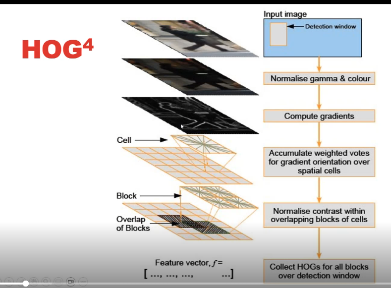
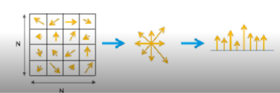

1. Histograms of oriented gradient(?)
2. Optical flow
3. Gaussian mixture models (GMM)

## 2018
Extrinsic / Intrinsic matrix
Optical flow
Colour model
Canny Edge
Hard negative mining
CNN output sizes         -> (N - F + 2 * p)/S + 1 

## Histograms of oriented gradients (HOGs)

Bounding boxes over the images (for invariance)
Normalise gamma (luminance?) and colour  
Compute edge magnitude and orientation ->   
Summarise edges for all pixels per cell(box) -> histogram of diff types of orientation  
Next, look at blocks, which is groups of cells (2x2)  
Overlap blocks and normalise contrast
Histogram binsize is in terms of degrees

Cell == bounding box
For each pixel in each cell, calc edge magnitude and orientation
Then make histogram (counts)

Block = group of cells
Normalize histograms to sum=1

## Optical flow
For each pixel one frame n, where does it go in frame 2. Orientation/direct and magnitude per pixel 
